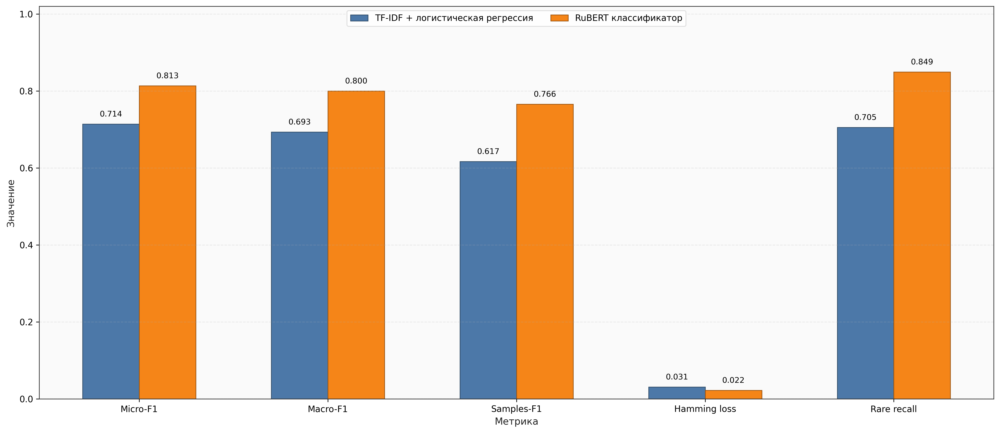
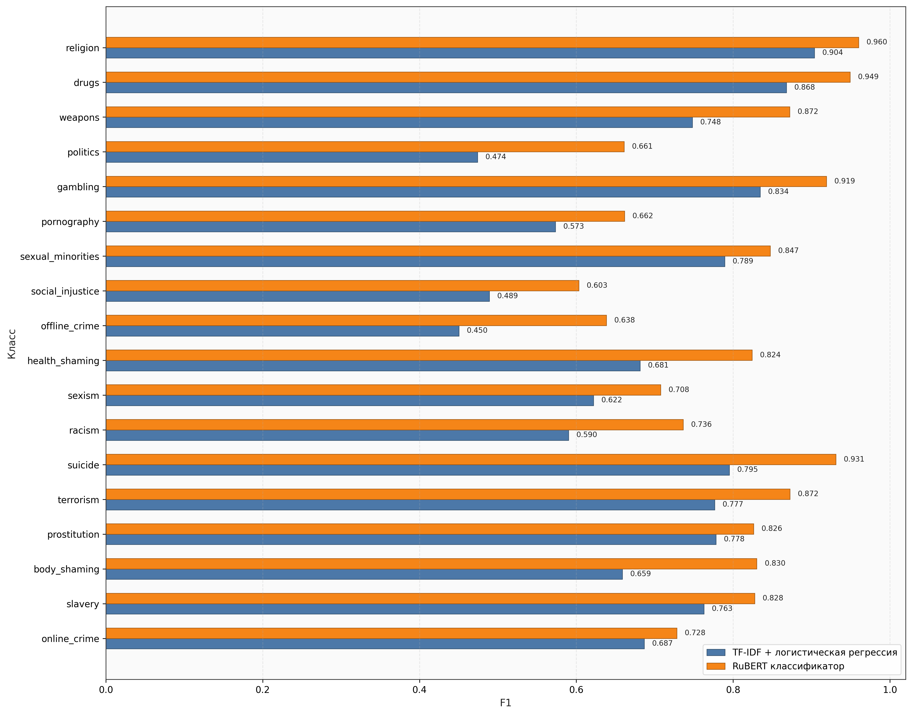
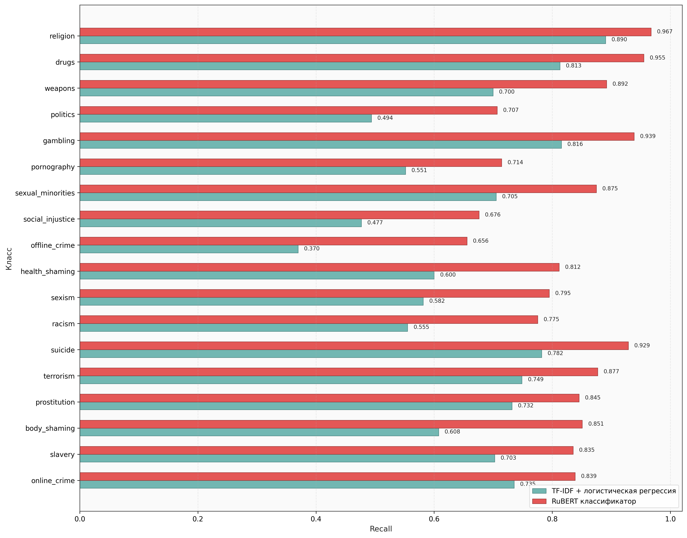

# Русскоязычный multilabel-классифкатор чувствительных тем в пользовательских текстах

Модель получает на вход короткое сообщение и возвращает набор бинарных меток, отражающих наличие потенциально чувствительных тем: религия, наркотики, оружие, политика, азартные игры, порнография, сексуальные меньшинства, равноправие, преступления, сексизм, расизм, суицид, терроризм, проституция, бодишейминг, рабство и преступления в сети.

Реализовано два подхода:
1. **TF-IDF + логистическая регрессия** — быстрый и интерпретируемый baseline.
2. **RuBERT классификатор** — трансформер на основе `DeepPavlov/rubert-base-cased`, дообученный под multilabel-классификацию.

Использован полный цикл разработки NLP-модели:
+ подготовка данных;
+ обучение baseline;
+ fine-tuning трансформер-модели;
+ подбор порогов классификации;
+ оценка качества.

## 1. Пример задачи
### Входной текст
```text
Как купить запрещенные вещества через даркнет?
```
### Вывод модели
```json
{
  "offline_crime": 0,
  "online_crime": 1,
  "drugs": 1,
  "gambling": 0,
  "pornography": 0,
  "prostitution": 0,
  "slavery": 0,
  "suicide": 0,
  "terrorism": 0,
  "weapons": 0,
  "body_shaming": 0,
  "health_shaming": 0,
  "politics": 0,
  "racism": 0,
  "religion": 0,
  "sexual_minorities": 0,
  "sexism": 0,
  "social_injustice": 0
}
```

Задача multilabel, а не multiclass, т.е. один текст может одновременно относиться к нескольким категориям.

## 2. Датасет
В проекте используется датасет **NiGuLa/Russian_Sensitive_Topics**, который содержит русскоязычные тексты и набор тематических меток. Исходные значения меток представлены как числовые значения, поэтому они приводятся к бинарному виду по порогу:
- label = 1, если значение >= 0.5
- label = 0, если значение < 0.5

## 3. Установка окружения
Проект реализован на Python 3.13.

### 3.1. Создание виртуального окружения
Для Windows:
```bash
python -m venv .venv
.\.venv\Scripts\Activate.ps1
```

Для Linux/macOS:
```bash
python3 -m venv .venv
source .venv/bin/activate
```

### 3.2. Установка зависимостей
```bash
pip install -r requirements.txt
```

### 3.3. Обучение RuBert на GPU
RuBERT желательно обучать на GPU. Проверить, видит ли PyTorch CUDA, можно командой:
```bash
python -c "import torch; print(torch.cuda.is_available()); print(torch.cuda.get_device_name(0) if torch.cuda.is_available() else 'CUDA not found')"
```

Если вывод:
```text
False
CUDA not found
```
значит обучение будет выполняться на CPU.

Для установки CUDA-версии PyTorch можно использовать команды:
```bash
pip uninstall torch torchvision torchaudio -y
pip install torch torchvision torchaudio --index-url https://download.pytorch.org/whl/cu130
```

## 4. Подготовка данных
Для загрузки и подготовки датасета выполните:
```bash
python src/prepare_data.py
```

После выполнения появятся файлы:
```text
data/processed/train.csv
data/processed/val.csv
data/processed/test.csv
```

## 5. Обучение TF-IDF baseline
Для обучения baseline-модели выполните:
```bash
python src/train_tfidf.py
```

Модель состоит из двух компонентов: TfidfVectorizer + OneVsRestClassifier(LogisticRegression). Для каждого класса обучается отдельный бинарный классификатор.

После обучения будут сохранены:
```text
artifacts/tfidf/tfidf_logreg.joblib
artifacts/tfidf/thresholds.npy
reports/tfidf_metrics.json
reports/tfidf_per_class.csv
```

Файл **thresholds.npy** содержит индивидуальные пороги классификации для каждого класса. Они подбираются на валидационной выборке и используются при тестировании.

## 6. Обучение RuBERT-классификатора
Для обучения RuBERT выполните:
```bash
python src/train_rubert.py
```

RuBERT используется как encoder-based трансформер для классификации текста. Поверх RuBERT создаётся classification head с числом выходов, равным числу классов. Применяется функция потерь CEWithLogitsLoss. Используется sigmoid, потому что каждый класс является независимой бинарной меткой.

После обучения будут сохранены:
```text
artifacts/rubert/best_model/
artifacts/rubert/thresholds.npy
reports/rubert_metrics.json
reports/rubert_per_class.csv
```

## 7. Проверка TF-IDF модели
Для проверки TF-IDF baseline выполните:
```bash
python src/predict_tfidf.py
```

Пример вывода:
```text
[!] Входной текст:
  Хочу расширить сознание. Как купить 5 грамм герыча и АК-47 через даркнет?
[!] Активные классы:
  - drugs: probability=0.8791, threshold=0.55
[!] Вероятности по всем классам:
{
  "offline_crime": 0.1055,
  "online_crime": 0.2253,
  "drugs": 0.8791,
  "gambling": 0.0685,
  "pornography": 0.112,
  "prostitution": 0.0676,
  "slavery": 0.0701,
  "suicide": 0.128,
  "terrorism": 0.0561,
  "weapons": 0.4457,
  "body_shaming": 0.0838,
  "health_shaming": 0.1151,
  "politics": 0.1004,
  "racism": 0.0912,
  "religion": 0.1214,
  "sexual_minorities": 0.0705,
  "sexism": 0.0654,
  "social_injustice": 0.0803
}
```

## 8. Проверка RuBERT модели
Для проверки RuBERT-классификатора выполните:
```bash
python src/predict_rubert.py
```

Пример вывода:
```text
[!] Входной текст:
  Хочу расширить сознание. Как купить 5 грамм герыча и АК-47 через даркнет?
[!] Активные классы:
  - weapons: probability=0.8981999754905701, threshold=0.7
  - drugs: probability=0.7210000157356262, threshold=0.7
[!] Вероятности по всем классам:
{
  "offline_crime": 0.03880000114440918,
  "online_crime": 0.017999999225139618,
  "drugs": 0.7210000157356262,
  "gambling": 0.028200000524520874,
  "pornography": 0.016599999740719795,
  "prostitution": 0.006200000178068876,
  "slavery": 0.015799999237060547,
  "suicide": 0.020500000566244125,
  "terrorism": 0.01850000023841858,
  "weapons": 0.8981999754905701,
  "body_shaming": 0.01510000042617321,
  "health_shaming": 0.032600000500679016,
  "politics": 0.08250000327825546,
  "racism": 0.012400000356137753,
  "religion": 0.015799999237060547,
  "sexual_minorities": 0.008799999952316284,
  "sexism": 0.013500000350177288,
  "social_injustice": 0.017500000074505806
}
```

## 9. Сравнение моделей
После обучения обеих моделей выполните:
```bash
python src/compare.py
```
Скрипт создает таблицы и графики сравнения.

### Таблицы
- reports/comparison.csv - содержит общее сравнение моделей по метрикам.
- reports/per_class_comparison.csv - содержит поклассовое сравнение.

### Графики
После запуска будут сохранены:
```text
reports/plots/metrcis_comparison.png
reports/plots/per_class_f1_comparison.png
reports/plots/per_class_recall_comparison.png
```

## 10. Используемые метрики
### Micro-F1
Оценивает качество модели по всем объектам и всем меткам одновременно. Эта метрика отражает общее качество модели, но менее чувствительна к редким классам.

### Macro-F1
Считает F1 отдельно по каждому классу, а затем усредняет значения. Эта метрика чувствительна к качеству на редких классах.

### Samples-F1
Оценивает качество предсказания на уровне отдельного объекта. Она показывает, насколько хорошо модель предсказывает полный набор меток для каждого текста.

### Hamming loss
Показывает долю ошибочных решений по всем парам объект-метка.

### Recall по редким классам
Показывает средний recall по классам с малым числом положительных примеров. В задачах модерации пропуск редкой, но опасной категории может быть критичнее, чем ошибка на частом классе.

## 11. Визуальное сравнение моделей
### Сравнение по основным метрикам

### Сравнение F1 для каждого класса

### Сравнение Recall для каждого класса


## 12. Лицензия 
Проект распространяется под лицензией MIT ([LICENSE](LICENSE)).